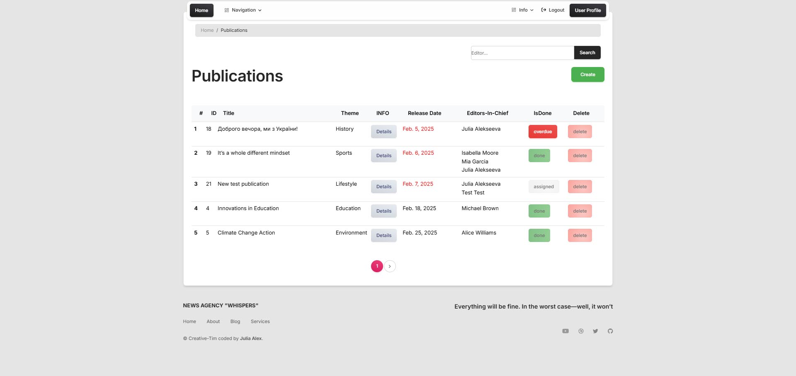

# news-agency-manager
- **News agency manager**  `Django project`


# prepositions
- All pages except `index.html` protected with `LoginRequiredMixin`. User should be authenticated for 
further actions.

- Use the following command to load prepared data from fixture to test and debug:
 ```python manage.py loaddata test_data.json```

- Publications are sorted by `publication_date`. Nearest shown first.
- If the publication date is within 2 days, the publication date in the Publications table will 
  be highlighted in red.

# description
- **General:**
	- navigation with dropdowns;
	- after sign-in in navbar appears button `UserProfile` that leads to `detail-page` for this user;

- **Publications (list view):** 
	- realized **search** by editor's surname;
	- publications are sorted by `publication_date`. Nearest shown first.
	- dates of publications which have **deadline** within 2 days (from now) will be 
      highlighted in 
      red;
	- publications that are not marked as **"Done"** by today data will automatically get the 
      status **"Overdue"**

- **Editors (list view):**
	- ordered by **last name**;
	- each editor has counter of assigned and overdue publications;

- **Editor (detail view):**
	- available list of publications for which this editor is responsible, and it's 
      possible to 
      view details of each publication in list and do *update/delete* actions in it;
	
- **Subject (list view):**
	- for each **subject** number of corresponding publications displayed, after clicking on it, 
      you will be redirected to list with connected publications (titles and deadline);

# Pages examples:
- **index.html**


- **publication-list.html**


